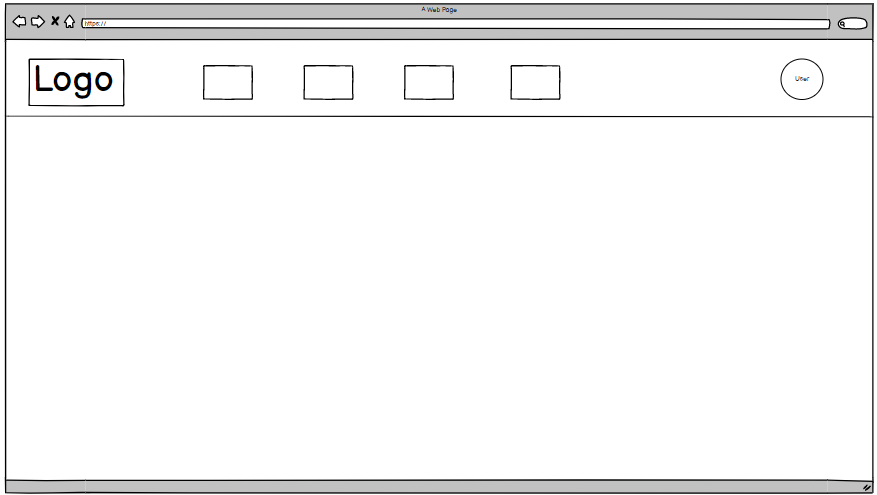
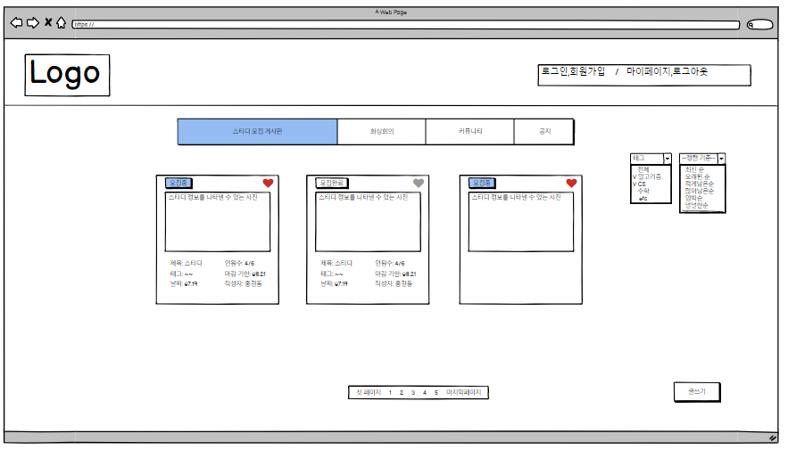
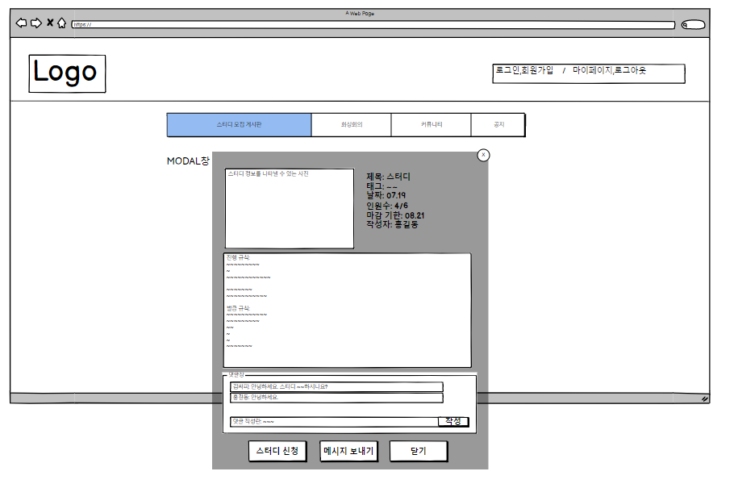
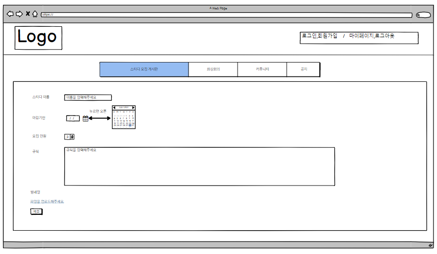
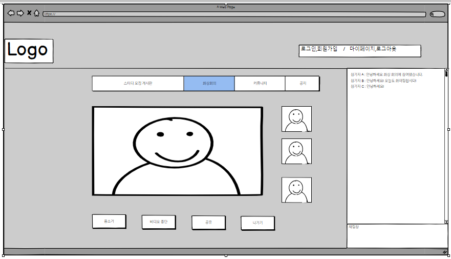
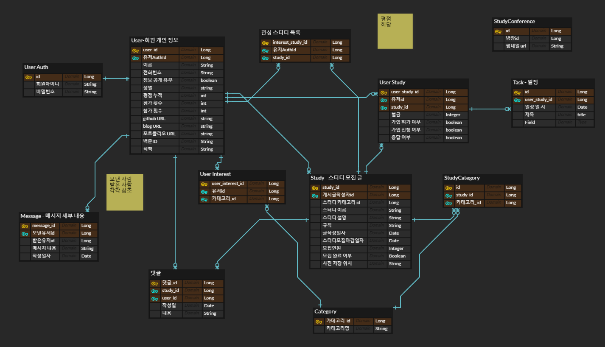

# 프로젝트 명

## 목차

- [프로젝트 소개](#프로젝트-소개)
- [텍스트 ... ](#프로젝트-소개)
- [프로젝트 명세](#프로젝트-명세)
  - [배포 환경](#배포-환경)
  - [개발 환경](#개발-환경)
  - [Design Resources](#design-resources)
  - [핵심 라이브러리](#핵심-라이브러리)
     

## 프로젝트 소개

### :blue_book: Studeveloper

 프로젝트 **Studevelopr**는 스터디 관리 기능 지원으로 사용자의 스터디 경험을 증대시킨다는 의미를 담고 있습니다. 기존의 스터디가 이루어지는 방식을 보면 커뮤니티, 혹은 오픈카톡방 등을 통해 인원을 모집한 후 다시 다른 창구(노션, 디스코드 등)에서 스터디가 진행되어 불필요한 동선을 보였습니다. 또한 열정을 갖고 스터디를 개설하였으나 어디서부터 시작해야 될 지 막막한 경우도 보셨을 겁니다.

 이 프로젝트는 스터디 모집, 관리, 진행을 하나의 사이트에서 진행하여 스터디를 진행하는 데 있어 소요되는 번거로움을 간소화시키고 스터디 진행 관리를 보조하여 본질의 목적인 학습에 더 집중하는 솔루션 제공을 목표로 하였습니다.

 사용자가 모집 게시글을 작성할 때 원활한 스터지 진행을 위한 기입 내용을 템플릿으로 만들어 주어 체계잡힌 스터디를 지원합니다. 그 게시글과 일대일로 대응되는 스터디 게시판을 개설해주고, 그 게시판에서 스터디 관리를 위한 데이터 혹은 도구를 제공합니다. 그 예시로는

- 스터디 개설 당시 정보를 바탕으로 한 벌금 집계 자동화
- 벌금 정보를 각 스터디 페이지에서 바로 열람 가능하여 벌금 납부 지연 방지 (방장은 입금 확인 시 간단한 버튼 클릭을 통해 내역을 변동할 수 있습니다.)
- 캘린더를 통한 일정 관리
- 각 주차별 파일을 업로드하고 다운받을 수 있는 툴을 이용한 스터디 아카이빙 지원
- 사용자의 백준아이디와 설정 조건을 바탕으로 solved.ac의 문제 검색 페이지로 링크 설정
- 다른 사용자의 스터디 진행 내용을 일부 열람 가능하게 하여 스터디 진행에 대한 이해도 상승 지원

등이 있습니다.

하단의 링크를 통해 저희의 프로젝트 노션 페이지로 이동 가능합니다.

[어떻게 작업하나요?]([싸피 1차(공통) 프로젝트 (notion.so)](https://www.notion.so/1-89b77ef2b833423786f8a5774c015b70))

 

## 프로젝트 명세

### :computer: 와이어프레임

- 첫 화면

<<<<<<< HEAD

- 스터디 모집 게시글

- 모집 게시글 상세

- 모집 게시글 작성

- 스터디 화상회의 페이지

- 마이 페이지

### ERD

### UseCase Diagram

### 배포 환경

- __URL__ : 
- __배포 여부__ : O
- __접속 가능__ : 접속 가능
- __HTTPS 적용__ : O
- __PORT__ : // 3rd Party에서 사용하는 포트가 있다면 기입해주세요. <- 기입 후 해당 주석 삭제

  

### 아키텍처

### 배포 환경

- **URL** :
- **배포 여부** : O / X
- **접속 가능** : 접속 가능 / 수정 중
- **HTTPS 적용** : O / X
- **PORT** : // 3rd Party에서 사용하는 포트가 있다면 기입해주세요. <- 기입 후 해당 주석 삭제
   

### 개발 환경

#### Front-end / Android

- **Framework** : Vue2
- **지원 환경** : Web
- **담당자** : 이현두, 황지원
   

#### Back-end

- **Framework** : Spring boot
- **Database** : MySQL
- **담당자** : 류영석,  손현식
   

#### Design

- **Framework 사용** : O
  - [Vuetify](https://vuetifyjs.com/)
  - [Bootstrap-vue](https://element-plus.org/)
- **Design Tool 사용** :
- **담당자** : 팀원 A, 팀원 B,
   

